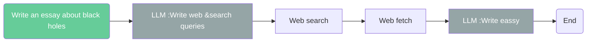
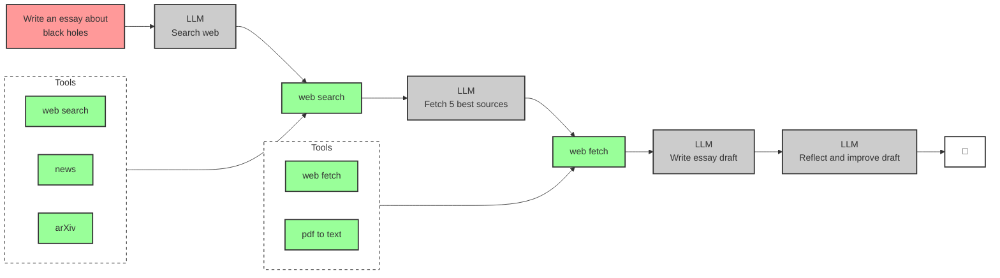
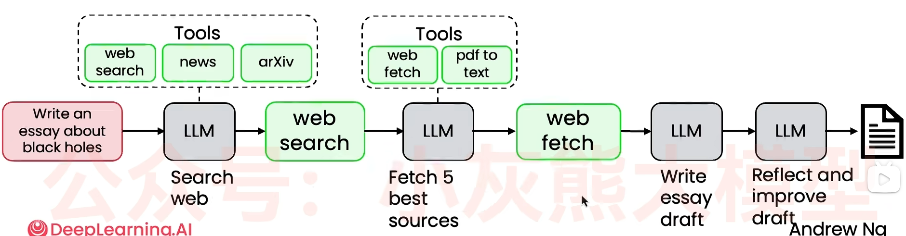

# 吴恩达Agent教程笔记 
https://www.bilibili.com/video/BV1DfrdByE2H/?spm_id_from=333.1387.favlist.content.click&vd_source=b2e33e56eb1d028eeabe864130de93cc

## 模块1：Introduction to Agentic Workflows
### 01 Welcome

### 02 What is Agent？
Agentic workflow：  
+ Write an essay outline on topic X
+ Do you need any web research?
+ Write a first draft
+ Consrelevantider what parts need revision or more research.
+ revise your draft. 

### 03 Degrees of autonomy
+ Less autonomous

+ more autonomous

### 04 Benefits of Agentic AI

### 05 Agentic AI applications
| Easier    | <──────────────────────────────────────> | Harder      |
|-----------|------------------------------------------|-------------|
| Clear, step-by-step process |                                                     | Steps not known ahead of time |
| Standard procedures to follow |                                                     | Plan/solve as you go |
| Text assets only |                                                     | Multimodal (sound, vision) |

分解复杂流程并找出各个独立步骤，让智能体按工作流顺序执行每一步，降低难度并提升最终成效。

### 06 Task decomposition: Identifying the steps in a workflow
|Direct generation|3-step workflow|5-step workflow|
|-------|-----|---------------|
|Write an eassy on topic X|write an essay outline on topic X|write an essay outline on topic X|
||search web|search web|
||write the essay|Write a first draft|
|||Consider what parts need revision|
|||Revise your draft|

即让LLM写一个初稿，再让LLM点评，让后根据点评继续完善。这样输出的文章效果会更优。

### 07 Evaluating  Agentic AI(evals)
***事实证明，具备评估和错误分析能力是非常关键的技能***
+ Can evaluate using code (objective evals),or LLM-as-judge(subjective evals)
+ Two types of evals
  + End-to-end 
  + component-level
+ Examine traces to perform error analysis
+ Much more on evals and error analysis in 课程模块 4!

### 08 Agentic design patterns

+ Reflection
    让AI反思是一种常见设计模式，你可以让LLM检查自己的输出，或者引入一些外部信息来源比如运行代码，看看是否有错误信息。并利用反馈再次迭代，生成更优的输出版本。
+ asdkfkj

